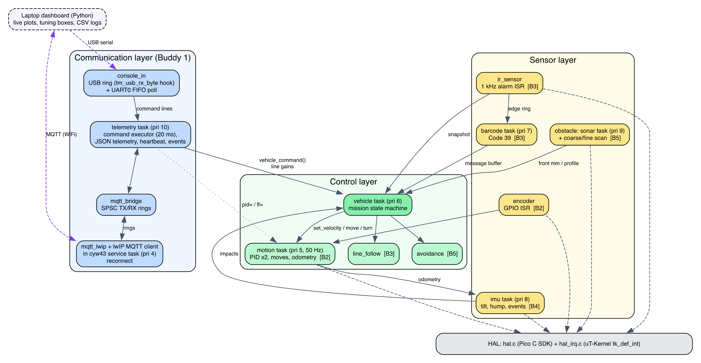
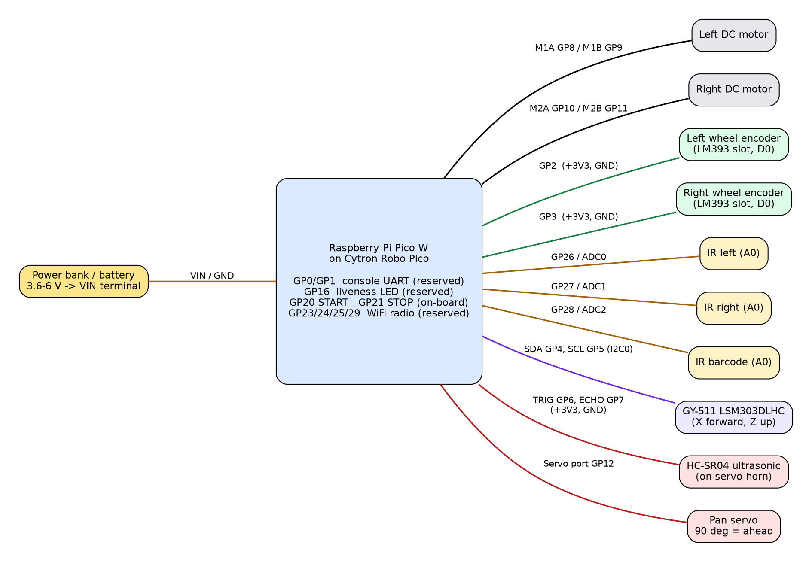
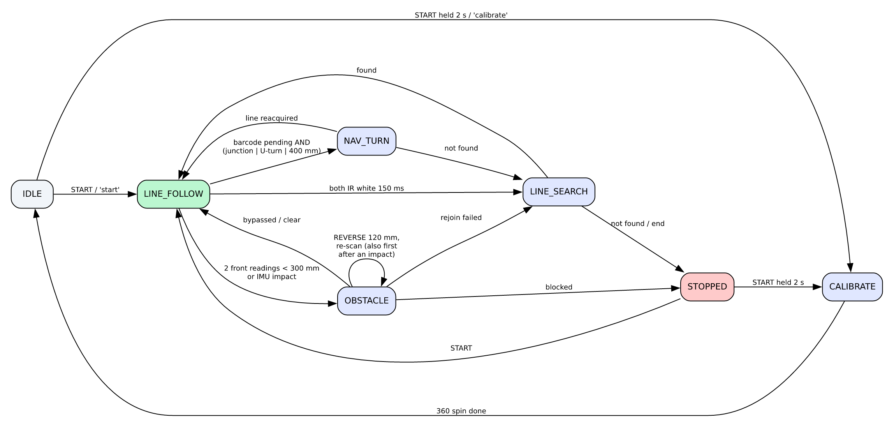

# 1. Introduction

This report documents the design, implementation, integration and verification of an autonomous robotic car that follows a line track, decodes directional barcodes, measures the highest speed hump on the route, profiles and bypasses static obstacles, and reports telemetry over WiFi. It follows the project write-up and the student briefing: the car runs **µT-Kernel 3.0** on a **Raspberry Pi Pico W** mounted on a **Cytron Robo Pico**, is written in **C** with the **Pico C SDK**, is built on the course template repository (`sirfonzie/mtk3smp-rp2040`) and is written to the **BARR-C:2018 Embedded C Coding Standard**. Section 8 shows how conformance is checked with tools that anyone can re-run, and lists the few deviations that the kernel, the template and the Pico SDK force on us.

The briefing's guidance — *"Start with interfaces, then build evidence"* — shaped the whole project. Every subsystem exposes a small C API, has its own standalone test program (`APP_MODE=TEST_xxx`), and every hardware-independent algorithm is unit-tested on a PC before it ever runs on the car.

## 1.1 Mission requirements and where they are met

| # | Requirement (write-up) | Implementation | Owner |
|---|---|---|---|
| 1 | Follow a line track autonomously | `line_follow.c` edge-tracking PID + `motion.c` wheel PID | B3, B2 |
| 2 | Detect and decode barcodes | `ir_sensor.c` 1 kHz edge capture + `barcode_decode.c` Code 39 | B3 |
| 3 | Execute Left / Right / Straight / U-turn | `vehicle.c::execute_nav()` using encoder turns | B3, B2 |
| 4 | Detect humps | `terrain_hump_update()` pitch state machine in `terrain.c` | B4 |
| 5 | Measure and report highest hump peak | height = Σ ds·sin(pitch); `max_peak_mm` in telemetry | B4, B1 |
| 6 | Detect obstacles on or near the line | background sonar monitor task, 300 mm threshold | B5 |
| 7 | Profile obstacle shape and position | coarse → fine servo scan + `avoidance_profile()` | B5 |
| 8 | Navigate around obstacles without collision | `avoidance_plan()` + box-bypass manoeuvre | B5, B2 |
| 9 | Reacquire the original line | `seek_line()` + `reacquire_line()` | B5, B3 |
| 10 | Report telemetry over WiFi | lwIP's MQTT 3.1.1 client, 5 Hz telemetry, heartbeat | B1 |

# 2. System Architecture

The software follows the suggested three-layer architecture (sensor, control, communication). A hardware-abstraction layer (HAL) sits underneath, and a vehicle controller coordinates the five subsystems.

{width=95%}

## 2.1 Real-time design on µT-Kernel

| Priority | Task / handler | Rate | Role |
|---|---|---|---|
| ISR | IO_BANK0 GPIO | on edge | wheel encoders, ultrasonic echo (µs timestamps) |
| ISR | TIMER alarm 3 | 1 kHz | samples 3 IR channels, barcode edge detection |
| 4 | `cyw43` (template) | 2 ms poll | WiFi radio, lwIP, **MQTT client via hook** |
| 5 | `motion` | 50 Hz (cyclic handler) | two speed PIDs, distance/turn moves, odometry |
| 6 | `vehicle` | 50 Hz | mission state machine, line-following loop |
| 7 | `barcode` | 100 Hz | frames + decodes barcode edge stream |
| 8 | `imu` | 50 Hz | tilt, hump, impact, turn-rate, motion events |
| 9 | `sonar` | ~14 Hz | front-distance monitor |
| 10 | `telemetry` | 20 ms loop | commands (USB, UART, MQTT), JSON telemetry (off–20 Hz), 1 Hz heartbeat, events |
| 10 | `blink` (template) | 2 Hz | liveness LED on GP16 |

The motion loop is woken by a **µT-Kernel cyclic handler** (`tk_cre_cyc`) calling `tk_wup_tsk`, so its period is drift-free. Timing-critical capture (encoders, echo width, barcode bars) happens in interrupt handlers registered with `tk_def_int`; heavier processing is deferred to tasks.

Inter-task communication uses µT-Kernel objects where blocking semantics are needed and lock-free structures where interrupt context is involved:

| Channel | Mechanism | Why |
|---|---|---|
| barcode → vehicle | message buffer (`tk_snd_mbf`) | queued commands, never lost |
| MQTT/telemetry → vehicle | message buffer | thread-safe commands from any task |
| motion move completion | event flag (`tk_wai_flg`) | tasks block until a move finishes |
| echo ISR → sonar | event flag set from ISR | measurement without busy-waiting |
| ultrasonic sharing | semaphore | monitor task and scans never ping together |
| IR ISR → barcode task | SPSC ring buffer | ISR must never block |
| tasks ↔ lwIP context | two SPSC rings with `dmb` barriers | the two worlds cannot share headers |
| status snapshots | `DI()/EI()` struct copy | microsecond critical sections |

## 2.2 Working within the template

Studying the template revealed constraints that drove several design decisions:

- **Pico SDK version.** The template is qualified against Pico SDK 2.2.0; newer SDKs fail to build it (`fixed_bitset.h`). We pin 2.2.0.
- **No SDK runtime.** The template links only selected SDK sources. `hal.c` therefore uses the SDK's header-only APIs (`hardware/pwm.h`, `adc.h`, `gpio.h`, `hardware_structs`), and implements I2C at register level, mirroring the SDK's `i2c_write_blocking` logic, because SDK `i2c.c` needs `clocks_init` and `pico_time`.
- **Header separation.** `<tk/tkernel.h>` and SDK/lwIP headers cannot share a translation unit because their `size_t` typedefs collide (we reproduced this compiler error). Every SDK-facing file (`hal.c`, `mqtt_lwip.c`) exposes a plain `stdint` API instead.
- **Single-owner peripherals.** The template's safety rules require each peripheral to have one owner. We disabled the kernel's sample ADC/I2C drivers (`config_device.h`) so the application owns ADC and I2C0 exclusively.
- **Reserved pins.** GP0/GP1 (console UART), GP16 (liveness LED) and GP23/24/25/29 (radio) are left untouched.
- **10 ms kernel tick.** This is too coarse for barcode sampling, so the 1 kHz sampler uses RP2040 hardware alarm 3 (unused by the kernel) with drift-free re-arming.
- **No MQTT in the template.** The CYW43 service task owns lwIP in `NO_SYS` mode and has no application hook. We added a weak `cyw43_utk_app_poll()` hook (5 lines) and a `WIFI_MQTT` build knob that enables lwIP TCP and compiles lwIP's own MQTT client (`apps/mqtt/mqtt.c`), which is in the SDK's lwIP tree but not in the template's build.
- **No usable console input.** The template's `tm_getchar()` spins with interrupts disabled until a byte arrives, which would freeze every task, and on the USB console received bytes are simply discarded. We read the UART0 receive FIFO without blocking (`hal_uart0_getc()`), and added a weak `tm_usb_rx_byte()` hook where the USB glue used to discard input. The USB service task, which owns TinyUSB, calls the hook and the bytes go into a lock-free ring.

## 2.3 Resource usage

| Build | Flash (text) | RAM (data+bss) |
|---|---|---|
| Mission, UART console | ≈ 68 KB | ≈ 16 KB |
| Mission, USB console + WiFi + MQTT | 359 KB | 58 KB |
| Application code only (linked, WiFi build) | 24.7 KB | 8.0 KB (+ 17.4 KB task stacks) |

The RP2040 has 264 KB of SRAM and 2 MB of flash, so all builds fit comfortably.

Efficiency choices:

- Integer fixed-point filtering in the 1 kHz ISR.
- Telemetry in integer units (no `printf` float support is needed).
- Custom soft-float `sqrt`/`atan2`/`sin`. The M0+ has no FPU, and newlib's libm is no shortcut: its `sqrtf()` and `atan2f()` set `errno`, which pulls newlib's stdio and system calls into an image that has none (we tried it: the builds without WiFi then fail to link).
- Event-driven echo and encoder capture instead of polling.
- Telemetry rate chosen so MQTT never saturates the TCP send buffer.

Estimated CPU cost (to be confirmed on hardware with a GPIO toggle and logic analyser):

| Item | Estimate | CPU share |
|---|---|---|
| IR ISR | ~15 µs per sample | ≈ 1.5 % |
| Motion loop | < 0.2 ms per cycle | < 1 % |
| IMU step, dominated by polled I2C | ≈ 0.6 ms | ≈ 3 % |

# 3. Hardware and Wiring

{width=100%}

| Device | Device pin | Pico / Robo Pico | Notes |
|---|---|---|---|
| Left motor | + / − | M1 terminals (GP8 / GP9) | MxA=PWM, MxB=0 → forward; swap wires or set `MOTOR_L_INVERT` if reversed |
| Right motor | + / − | M2 terminals (GP10 / GP11) | `MOTOR_R_INVERT` likewise |
| Left encoder | VCC / GND / D0 | 3V3 / GND / **GP2** | Grove 2 |
| Right encoder | VCC / GND / D0 | 3V3 / GND / **GP3** | Grove 2 |
| IR left | VCC / GND / **A0** | 3V3 / GND / **GP26 (ADC0)** | use analog output, D0 unused |
| IR right | VCC / GND / **A0** | 3V3 / GND / **GP27 (ADC1)** | |
| IR barcode | VCC / GND / **A0** | 3V3 / GND / **GP28 (ADC2)** | |
| GY-511 IMU | VIN / GND / SDA / SCL | 3V3 / GND / **GP4 / GP5** | I2C0 at 400 kHz; chip X axis forward, Z up |
| HC-SR04 | VCC / GND / TRIG / ECHO | 3V3 / GND / **GP6 / GP7** | per course slide; a 5 V module needs a divider on ECHO |
| Servo | signal / V+ / GND | **Servo port GP12** | 90° = straight ahead |
| Buttons | — | GP20 START, GP21 STOP | on-board |
| Power | — | VIN terminal 3.6–6 V | common ground for everything |

**Mounting notes.**

- **Line sensors.** Place the two sensors so each IR spot sits on one edge of the 18 mm line (≈18 mm apart). Centred, each reads ≈0.5, which gives the steepest, most linear error signal.
- **Barcode sensor.** Offset it to the barcode side, ≈45–50 mm from the line centre. The barcode lies 20 mm beyond the line edge (see the course barcode specification).
- **Grove port 5 and 6 share GP26.** Wire only the listed pins.

# 4. Subsystem Design

## 4.1 Buddy 1 — WiFi Communication, Command and Telemetry

**Communication API** (`mqtt_bridge.h`): `mqtt_bridge_publish(topic, json)`, `mqtt_bridge_get_command(buf, size)`, `mqtt_bridge_get_stats(&stats)`. Application tasks never touch lwIP. Two single-producer/single-consumer rings carry messages into and out of the lwIP context, using memory barriers so they are also correct under the template's dual-core SMP profile.

**MQTT client** (`mqtt_lwip.c` on lwIP's `apps/mqtt`). lwIP's own MQTT 3.1.1 client does the protocol work: CONNECT with last will, PUBLISH, SUBSCRIBE, keep-alive pings and the broker watchdog. `mqtt_lwip.c` manages the connection and moves messages between that client and the bridge. It runs inside the template's CYW43 task through the new hook, so all lwIP calls stay in one context as `NO_SYS` requires. An earlier version carried its own MQTT encoder and decoder; a simplification review replaced them with the client lwIP already ships.

**Connection recovery:**

- The client connects only once the link is up and DHCP has an address.
- Each attempt (TCP connect and CONNACK) gets 2 s, then 4 s, then 8 s; an attempt not accepted by then is abandoned and the next one starts. A session that drops reconnects at once.
- lwIP's client sends PINGREQ after `keepalive` seconds without sending, and closes the session if nothing (data or a TCP acknowledgement) arrives for 1.5 × keepalive, so steady telemetry cannot cause a false disconnect.
- The last-will message marks the car `offline` if it disappears.

### MQTT documentation

| Topic | Dir | Rate | Content |
|---|---|---|---|
| `picocar/<id>/telemetry` | pub | 5 Hz (`rate=` 0–20 Hz) | full snapshot (below) |
| `picocar/<id>/heartbeat` | pub | 1 Hz | `up` s, `seq`, state, link statistics, IMU health |
| `picocar/<id>/event` | pub | on change | `state`, `barcode`, `hump`, `obstacle`, `impact`, `cmd` ack, `gains`, `help` |
| `picocar/<id>/status` | pub, retained | connect / LWT | `online` / `offline` |
| `picocar/<id>/cmd` | sub | — | text commands, see *Commands and live tuning* below |

Telemetry fields and units (integers only, which keeps it resource-friendly):

- `t` run time in ms; `st` vehicle state.
- `spd`/`tgt` wheel speed and target (mm/s); `pwm` duty (%); `enc` encoder ticks.
- `odo` distance (mm); `hdg`, `pitch`, `roll`, `yaw` angles (deci-degrees); `rate` turn rate (deci-°/s).
- `ir` normalised IR readings (per-mille); `le` line error (per-mille); `ls` line state (ON / LOST / JUNC).
- `bc` last barcode, `nav` last command, `nbc` barcode count.
- `hump` object {`h` current height, `pk` last peak, `max` run maximum (mm), `n` humps}.
- `ev` motion event; `front` sonar distance (mm); `act` last avoidance action; `nobs` obstacles passed.

### Commands and live tuning

The same text commands are accepted on the MQTT `cmd` topic **and** typed on the USB or UART serial console. So gains can be tuned without reflashing in every build, including the test builds that have no WiFi. `command.c` parses them (pure C, 28 unit tests) and the telemetry task executes them within 20 ms.

| Command | Effect | Applied by |
|---|---|---|
| `start`, `stop`, `calibrate` | run control, as the GP20/GP21 buttons | vehicle task (message buffer) |
| `speed=<mm/s>` | cruise speed, 60–300 (barcode sampling limit, NFR2) | vehicle task |
| `pid=<kp>,<ki>,<kd>` | wheel-speed PID, both wheels | `motion_set_speed_gains()` |
| `ff=<kf>,<offset>` | feed-forward (%/(mm/s)) and static-friction offset (%) | `motion_set_feedforward()` |
| `line=<kp>,<ki>,<kd>` | line-following PID, applied without resetting the running controller | vehicle task, which owns the follower |
| `rate=<ms>` | telemetry period: 0 = off, 50–5000 | telemetry task |
| `gains`, `help` | report the gains in use / list commands | telemetry task |

- Keywords are case-insensitive and spaces are ignored.
- Every command is answered with `{"type":"cmd","cmd":"…","ok":1}`, or `"ok":0` with the reason (for example `wrong number of values`, `gain out of range 0..1000`, or `not available in this build`).
- Every change is followed by `{"type":"gains","pid":[…],"ff":[…],"line":[…],"speed":…,"rate":…}` with the values now in use. It is sent 60 ms later so the vehicle task has applied line gains first; review caught that an immediate reply would have reported the old values.
- Gains live in RAM and reset on reboot. The final values are copied into `car_config.h`, because the template forbids flash writes without parking the second core.
- Serial input is limited to 64-character lines. On the UART, commands are paced in 16-byte chunks so the 32-byte receive FIFO (polled every 20 ms) never overflows; the dashboard does this automatically.

### Laptop dashboard and telemetry demonstration

`tools/dashboard/picocar_dashboard.py` (Python: matplotlib, paho-mqtt, pyserial) connects over MQTT (`--mqtt <broker>`) or over the USB cable (`--serial auto` finds the Pico by its USB vendor ID 0x2E8A).

{width=100%}

- **Live plots of the last 30 s:** wheel speed against target, line error and IR, pitch and hump height, and front distance against the 300 mm threshold.
- **Status panel:** state, barcode, run-maximum hump peak, obstacles, and link health (heartbeat, reconnects, dropped messages).
- **Controls:** Start, Stop, Calibrate, a 20 Hz telemetry button, and tuning boxes pre-filled from the car's `gains` event, each with an Apply button.
- **Logging:** every session is saved to `logs/<date_time>/`: `telemetry.csv` (33 columns in engineering units), `events.csv`, `heartbeat.csv`, `commands.log` and `console.log`. These files are the raw evidence for the tables in this report, and **Save PNG** stores the plots alongside them.

`tools/dashboard/sim_car.py` publishes the firmware's exact message formats and obeys the same commands. Its wheel model uses the firmware's PID law, so a `pid=` change visibly alters the response. It was used to verify the dashboard end to end against a Mosquitto broker: commands, acks, rejected commands, rate changes and logging. The serial path was verified against an emulated console on a pseudo-terminal.

**Recovery demonstration.** Stop and restart the broker: the heartbeat's reconnect counter increments and publishing resumes. Without `WIFI_MQTT`, the same JSON is printed on the USB console at 1 Hz, so the dashboard's serial mode demonstrates the telemetry framework without a network.

## 4.2 Buddy 2 — Motion Control System

**Motor driver** (`motor.c`). 10 kHz PWM (the Robo Pico maximum is 20 kHz) drives MxA while MxB is held low, which gives drive-brake operation and a near-linear speed-to-duty curve.

**Encoders** (`encoder.c`). Both edges are counted for distance resolution: π·65/40 = 5.1 mm per tick. Speed uses rising-to-rising periods, which are immune to uneven slot and bar widths. A moving average of 4 periods is used, and the estimate decays towards zero when the wheel slows (the elapsed time since the last edge bounds the period). A 300 µs glitch filter rejects comparator chatter.

**Speed control** (`pid.c`, `motion.c`). One PID controller per wheel runs at 50 Hz: output = kf·setpoint + kp·e + I − kd·d(measurement)/dt, plus a static-friction offset.

- Taking the derivative on the measurement avoids set-point kick.
- Conditional integration with clamping prevents integral wind-up.
- The single-channel encoders cannot sense direction, so the controller works on speed magnitude and applies the commanded sign.

**Straight-line correction.** During moves, the wheel that is ahead is slowed and the one lagging is sped up, by `STRAIGHT_KP` × (dL − dR).

**Encoder turns.** Each wheel travels π·W·θ/360 in opposite directions. Moves slow down over the last 80 mm and have a stall timeout of 3× the ideal time + 1 s.

**Required APIs:**

- `motion_move_forward(mm, speed)`, `motion_move_backward(mm, speed)`
- `motion_turn_left(deg)`, `motion_turn_right(deg)`, `motion_stop()`
- `motion_set_velocity(vl, vr)` for line following
- `motion_wait()` returns OK / BUSY / FAIL, so callers can abort
- `motion_get_status()` provides odometry, heading and turn rate

### PID tuning report

**Method.** Use `APP_MODE=TEST_MOTOR` with the dashboard in serial mode.

1. Press START. The first run makes an open-loop duty sweep (0–100 % in 10 % steps) through the motion task's open-loop mode. Plot speed against duty: the slope gives the feed-forward gain (%/(mm/s)) and the x-intercept gives the static-friction offset (the dead-band). Send both with `ff=<kf>,<offset>`.
2. The test then logs closed-loop steps (0 → 100 → 180 → 0 mm/s) as CSV at 25 Hz, headed by the gains in use (`# step test with pid=… ff=…`). **Fast 20 Hz** also shows the response live.
3. Change `pid=` and press START again. Only the step test repeats, so each iteration takes about 10 s instead of a rebuild and reflash. Tune in the order kf → kp (until slight overshoot, then back off 30 %) → ki (removes steady-state error) → kd (only if oscillation remains).
4. Copy the final values into `car_config.h`. `console.log` keeps every step run for the table below.

While adding live tuning we found and fixed a defect in the original motor test. Every re-run called `motion_init()` again, which created a second control task and cyclic handler. The duty sweep also drove the motors directly while the control task braked them every 20 ms. `motion_init()` is now idempotent, and the sweep runs through the new `motion_set_open_loop()` mode.

**Simulation baseline.** A first-order motor model (5 mm/s per % duty, τ = 0.15 s) with the default gains reaches 180 mm/s with 0 % overshoot and under 5 % error within 2 s (host test `test_pid`).

Record on the real car:

| Gains (kp / ki / kd / kf) | Rise time 10–90 % | Overshoot | Settling (±5 %) | Steady error |
|---|---|---|---|---|
| 0.08 / 0.60 / 0 / 0.10 (default) | ___ ms | ___ % | ___ ms | ___ mm/s |
| iteration 2: ___ | ___ | ___ | ___ | ___ |
| final (copied to `car_config.h`): ___ | ___ | ___ | ___ | ___ |

### Motion accuracy evaluation

`APP_MODE=TEST_MOTION` runs: forward 500 mm, left 90°, right 90°, backward 500 mm, U-turn 180°. It prints the encoder distance and heading for each move. Measure the real result with a tape and protractor over 5 runs, then calibrate `WHEEL_DIAMETER_MM` from the distance error and `TRACK_WIDTH_MM` from the turn error.

| Move | Commanded | Measured (mean ± sd, n=5) | Error |
|---|---|---|---|
| Forward | 500 mm | ___ | ___ |
| Left turn | 90° | ___ | ___ |
| Right turn | 90° | ___ | ___ |
| Backward | 500 mm | ___ | ___ |
| U-turn | 180° | ___ | ___ |

## 4.3 Buddy 3 — Barcode Decoding and IR Line Following

**Calibration** (`ir_sensor.c`). Each channel tracks its minimum and maximum while the car spins 360° over the line (`calibrate` command, or START held for 2 s while idle). Readings are normalised to 0 = white and 1 = black, per channel. This makes the algorithm robust to lighting changes and to differences between sensors. Calibration is rejected if the contrast is below 200 counts.

**Line position and following** (`line_follow.c`). The error is L − R, in the range [−1, 1]. A PID controller turns it into a differential wheel speed, and the base speed drops by up to 50 % on large errors for stability at varying speeds.

- **LOST** is declared only after 150 ms with both sensors on white.
- **JUNCTION** is declared only after 10 mm of travel with both sensors on black.
- These confirmations mean a single noisy sample cannot trigger an action.

**Line PID tuning.** Build `MISSION`, press **Start** on the dashboard, and adjust `line=<kp>,<ki>,<kd>` while the car follows the line. The new gains take effect immediately without resetting the controller, so the line-error plot shows the change straight away. A good result is a line error that settles close to 0 on straights without sustained oscillation. Record the tuned values:

| Line gains (kp / ki / kd) | Speed | Line-error RMS on straight | Laps without losing the line |
|---|---|---|---|
| 160 / 0 / 12 (default) | 180 mm/s | ___ | ___ /5 |
| final: ___ | ___ | ___ | ___ /5 |

**Barcode** (`barcode_decode.c`). The course barcode is **Code 39**. We decoded the provided specification photo by hand as `*A*` (start, A, stop) and used the photo's bar widths as a test vector. Bars and spaces are timed with 1 µs resolution by the 1 kHz sampler, using hysteresis (0.6 / 0.4). A frame ends after 250 ms of white.

Decoding classifies the **3 widest of each 9 elements as wide**. Code 39 guarantees exactly three wide elements per character, so this works regardless of speed and only assumes the speed is steady over one ≈40 mm character. A frame that fails forwards is reversed and decoded again, because the car may read the code from either end. Frames must start and end with `*`, which rejects line crossings and noise.

**Navigation command interface.** Decoded characters map A→LEFT, B→RIGHT, C→STRAIGHT and D→U-TURN. Commands reach the vehicle task through a message buffer.

The vehicle executes a command at the next junction:

1. Advance by the sensor-to-axle offset.
2. Make an encoder turn.
3. Sweep to re-centre on the line.

A U-turn is executed immediately. If no junction appears within 400 mm, the command is executed anyway.

**Verification.**

- The photo vector decodes to `A` forwards and backwards.
- 1000/1000 synthetic frames of A–D decode correctly with ±20 % width noise, ±1 % per-element speed drift, in both directions.
- Uniform widths and truncated frames are rejected.

Hardware test: `APP_MODE=TEST_BARCODE` (drive or push the car over each barcode 10 times) and record the success rate: A ___/10, B ___/10, C ___/10, D ___/10 at 100 mm/s and ___/10 at 180 mm/s.

## 4.4 Buddy 4 — IMU-Based Motion and Terrain Monitoring

**IMU processing** (`imu.c`). The LSM303DLHC is configured as follows (values from its datasheet):

- Accelerometer: 100 Hz, ±2 g, high-resolution mode, 1 mg/LSB.
- Magnetometer: 75 Hz, ±1.3 gauss.

At start-up, 100 samples taken while the car is still give the accelerometer biases. The magnetometer's hard-iron offsets come from the min/max recorded during the 360° calibration spin.

**No gyroscope.** The GY-511 has no gyro, so:

- Pitch = atan2(ax, √(ay²+az²)), with the car's own acceleration (d(speed)/dt from the encoders) removed from ax first, so that braking is not mistaken for a slope.
- Turn rate is reported from the encoders ((vR − vL)/track) and from the magnetometer heading derivative.
- An impact is a jerk (sample-to-sample change of the acceleration vector) above 700 mg, with a 500 ms hold-off. An impact during line following triggers an obstacle scan.

**Hump-detection algorithm** (`terrain.c`). Double-integrating acceleration drifts quadratically, so height is instead the path integral **h = Σ ds·sin(pitch)**, with ds from the encoders (arc length). Integration only runs during a hump, which bounds drift.

- A hump starts when |pitch| exceeds 6°.
- A pre-roll accumulator adds the height already gained while the slope was gentle. Without it the estimate was 14 % low on a 60 mm hump; adding it came from a host-test failure.
- The hump ends after 30 mm of level travel with the height back below 35 % of the peak.
- Humps must be at least 5 mm high, and the tracker abandons a "hump" longer than 1.5 m (a ramp or drift).
- The run maximum `max_peak_mm` is reported in telemetry and as a `hump` event.

**Motion classification.** Events are STATIONARY, CRUISING, ACCELERATING, DECELERATING, TURNING, CLIMBING, DESCENDING and IMPACT, in that priority order.

### Terrain analysis report

Simulation: a raised-cosine hump 250 mm long, crossed at 150 mm/s and 50 Hz, with ±1° random pitch noise.

| True height | Estimated peak | Error |
|---|---|---|
| 20 mm | 20.1 mm | +0.6 % |
| 30 mm | 30.4 mm | +1.3 % |
| 40 mm | 40.1 mm | +0.3 % |
| 60 mm | 60.0 mm | +0.0 % |
| flat floor | no hump | correct |

On the course (`APP_MODE=TEST_IMU`, CSV output), measure each hump with a ruler and compare:

| Hump | Ruler height | Estimates (5 runs) | Mean error |
|---|---|---|---|
| 1 | ___ mm | ___ | ___ |
| 2 | ___ mm | ___ | ___ |

## 4.5 Buddy 5 — Adaptive Ultrasonic Scanning and Obstacle Profiling

**Scanning subsystem** (`ultrasonic.c`, `servo.c`, `obstacle.c`).

- The HC-SR04 echo width is timestamped by GPIO interrupts (no busy-waiting), with distance = µs × 0.1715 mm.
- The datasheet's 60 ms minimum cycle is enforced, and each scan point takes the median of 3 readings.
- A background task monitors the front distance at ≈14 Hz. Two readings in a row under 300 mm are needed to stop the car, so one spurious echo is ignored. Front and impact triggers are ignored while the IMU reports the car on a hump: the sonar sees the floor when the nose dips, and the landing jolt can look like an impact.
- **Stage 1 (coarse):** readings at 30°, 60°, 90°, 120° and 150°.
- **Stage 2 (fine):** if anything is under 300 mm, the sensor rescans ±20° around the detected region in 5° steps.

**Obstacle profile generator** (`avoidance.c`). Each reading is placed sideways at lateral = d·cos(a), positive to the right of the car.

- The obstacle is the closest echo **inside the car's corridor**, grown into a cluster of neighbouring echoes within 150 mm of it.
- An early version chose the closest echo anywhere, so a nearby side wall hid the real obstacle. The unit test caught this.
- Outputs: closest point and angle, left and right edges, width, lateral centre, and left/right clearance (the gap to any other object at a similar range).

**Avoidance algorithm.** Possible actions are CONTINUE, STOP, TURN_LEFT, TURN_RIGHT and REVERSE.

- CONTINUE if the obstacle lies entirely outside the corridor.
- REVERSE 120 mm and re-scan if it is closer than 90 mm (at most 2 attempts, then STOP).
- Otherwise, pass on the feasible side (clearance ≥ car width + 60 mm) that needs the **smaller sideways offset**. This minimises deviation from the original route, as the write-up requires.

**Bypass and recovery algorithm** (`vehicle.c`):

1. Turn 90° towards the chosen side and sidestep by the planned offset.
2. Turn back to parallel. Point the sonar sideways at the obstacle and advance in 50 mm steps until the obstacle's far end is passed, then add one car length.
3. Turn back towards the line and drive until either IR sensor sees it.
4. Advance by the sensor-to-axle offset, turn to the original heading, and sweep until centred.
5. Hand control back to line following.

Every step is abortable, including the scan (STOP is checked before each servo step), and failures fall back to LINE_SEARCH. After an IMU impact the car first reverses 120 mm, because the HC-SR04 gets no echo closer than 20 mm and the scan would otherwise report a clear path.

**Servo direction.** The code assumes 0° points to the car's right. `SERVO_INVERT` in `car_config.h` corrects a mirrored mount; `TEST_ULTRASONIC` prints which side the closest echo is on, so a box offset to the right must read RIGHT.

**Verification.**

- Synthetic scan of a 100 mm box at +20 mm lateral and 250 mm range: estimated width 89 mm, centre 22 mm, decision TURN_LEFT.
- The same box with a wall 200 mm to the left: TURN_RIGHT.
- Too close: REVERSE, then STOP.
- Box outside the corridor: CONTINUE.

**Hardware test procedure** (`APP_MODE=TEST_ULTRASONIC`, then `MISSION`). Save the serial console to a file and run `python3 tools/scan_plot.py <log> --box X,Y,W` for one figure per scan and the error table.

1. **Servo direction (A9).** Put a box 250 mm ahead and 60 mm to the right. The console must say `closest echo on the RIGHT`; otherwise set `SERVO_INVERT` to 1 in `car_config.h`.
2. **Profile accuracy (A9).** Take three scans per position and record the mean (true / estimated, mm).

| Box position (tape) | Closest | Left edge | Right edge | Width |
|---|---|---|---|---|
| centred, 150 mm | ___ / ___ | ___ / ___ | ___ / ___ | ___ / ___ |
| centred, 250 mm | ___ / ___ | ___ / ___ | ___ / ___ | ___ / ___ |
| 60 mm right, 250 mm | ___ / ___ | ___ / ___ | ___ / ___ | ___ / ___ |
| 60 mm left, 250 mm | ___ / ___ | ___ / ___ | ___ / ___ | ___ / ___ |

3. **Avoidance and recovery (A10).** With the obstacle on the line, do 10 runs in `MISSION`: bypass completed ___/10, line re-acquired ___/10, largest sideways deviation ___ mm.
4. **Safety.** Tap STOP during a scan: the car stops within one servo step. Bump a box: the car reverses 120 mm, then scans. Drive over the hump: no obstacle stop, and the front range stays above 300 mm on the approach (A12). A full scan, bypass and calibration run without a watchdog reset.

# 5. Integration — Vehicle Controller

{width=100%}

The vehicle task owns mission state and is the only caller of motion commands during a run, which avoids conflicting commands. Subsystems communicate only through their public APIs. Manoeuvres are sequences of blocking moves, but every wait, and every step of an obstacle scan, polls the STOP button and MQTT `stop`, so the car can always be halted.

Controls:

- **GP20 (START)** acts on release, so the car never moves under the user's hand: a short press starts a run; held for 2 s while idle, it runs calibration.
- **GP21 (STOP)** stops the car and never moves it. Presses are latched by an interrupt, so a short press during a scan is not missed.
- MQTT commands can do the same remotely.

A new run discards barcodes decoded while the car stood still (pushed by hand, or seen during the calibration spin), so they cannot become its first turn.

# 6. Verification and Evidence

**Build verification.** All eight application modes (MISSION, TEST_MOTOR, TEST_MOTION, TEST_IR, TEST_BARCODE, TEST_IMU, TEST_ULTRASONIC, TEST_TELEMETRY), the UART-console build and the WiFi+MQTT build compile against the template and Pico SDK 2.2.0 with **zero warnings** (last checked with arm-none-eabi-gcc 15.3.1). Application files are compiled as strict C99 (`-std=c99 -Wpedantic`) with `-Wall -Wextra -Wsign-conversion -Wfloat-equal -Wdouble-promotion -Wshadow` (section 8). We also checked in the linked image that both template hooks (`cyw43_utk_app_poll`, `tm_usb_rx_byte`) resolve to the application's strong symbols. The disassembly shows the USB service loop calling our `tm_usb_rx_byte`.

**Host unit tests** (`make -C tests/host`): **124/124 pass**. The host build uses the same C99 and warning flags as the firmware, plus `-Werror`.

| Module | What is proven |
|---|---|
| car_math | sqrt rel. error 1.2e-7, atan2 0.0007°, sin 3.6e-6; whole-turn reduction; a non-finite or huge input gives 0 |
| pid | settles within 5 %, no overshoot on the motor model, integral clamped, a non-finite input gives 0 |
| line_follow | steering sign, LOST/JUNCTION confirmation |
| barcode_decode | course photo = `*A*` both directions; 1000/1000 noisy frames |
| terrain | hump height within 1.3 % (table in §4.4), no false humps |
| avoidance | width/centre estimates, side choice with a wall, reverse/stop/continue |
| mqtt_lwip | against a fake lwIP (`tests/host/lwip/`): no attempt without a network, a 2 s window before a new attempt, `online` (retained) and the `cmd` subscription on connect, a message kept while the client is full, commands only from the `cmd` topic, reconnects counted |
| mqtt_bridge | ring capacity, drop-when-offline, command path |
| vehicle + obstacle | the real `vehicle.c`, `obstacle.c` and `servo.c` in a simulation on a fake µT-Kernel (`tests/host/sim/`, `tk/`, `tm/`) with simulated time, buttons, motion, IR, IMU and sonar: START on release and 2 s hold to calibrate, STOP never moves the car, a 6 ms STOP press between polls is latched, speed limited to 300 mm/s; one close echo ignored and two stop the car; coarse then fine scan and the box-shaped bypass back to the line; reverse before the scan after an impact; triggers ignored on a hump; a STOP or `stop` ends a scan at the next servo step; a STOP in a line search, U-turn or bypass gives one `STOPPED (stop command)`; stale barcodes discarded at START; longest gap between watchdog feeds 774 ms. Each of these fixes was broken on purpose once to confirm a check fails |
| command | every command and its limits, spaces and case, rejection of bad counts, negative gains and trailing text; serial line assembly (CRLF, backspace, control bytes, overflow recovery); 3-decimal formatter (including NaN); live line gains surviving re-initialisation |

**Dashboard.** Tested end to end against a Mosquitto broker with `sim_car.py`, which checked commands, acks, rejected commands, rate changes and CSV logs. The serial path was tested against an emulated USB console on a pseudo-terminal. That test also confirmed the 16-byte write pacing and that the dashboard requests the gains when the port opens.

**Hardware tests.** Each buddy's `APP_MODE` test program prints CSV for the tables in section 4. Run them in this order: motor → motion → IR → barcode → IMU → ultrasonic → telemetry → mission. That order matches the briefing's "repeatable subsystem tests, then integrate early".

The review-and-test cycle found and fixed eight defects before any hardware run:

1. MQTT keepalive starvation.
2. Wall-masked obstacle.
3. Hump under-estimation.
4. The `size_t` header clash.
5. A stale START request restarting the car.
6. A test-vector error.
7. `TEST_MOTOR` starting a second motion task on every re-run.
8. A gains report after `line=` that could show the previous values.

The BARR-C conformance pass and the independent review of it found seven more; they are listed in section 8.3.

# 7. Robustness

- **Sensor faults.** Missing echoes, I2C timeouts (2 ms per transfer, counted in the heartbeat as `i2cerr`) and low-contrast calibration are all detected and reported. They never hang a task.
- **Motion safety.** Every move has a stall timeout and every manoeuvre can be aborted.
- **Watchdog.** The vehicle task starts the RP2040 watchdog (`WATCHDOG_TIMEOUT_MS`, 3 s) and feeds it in every wait, at least once a second (the longest gap is one scan step). If the task stalls, because it or a higher-priority task hangs, the chip resets, which turns the motor outputs off, and the first state after boot reports `watchdog reset` as its reason.
- **Line recovery.** A lost line gets an expanding sweep search before the car gives up with a reason.
- **Collision.** An IMU impact triggers a stop, a 120 mm reverse, a scan and avoidance.
- **Communication.** Reconnection uses back-off, the last-will marks the car offline, a heartbeat sequence number reveals lost messages, and telemetry is simply dropped (and counted) when offline, so control is never delayed by the network.
- **Real-time.** Control runs at higher priority than communication, and interrupt handlers are short.

# 8. Software Quality — BARR-C:2018 Conformance

All application code (`app_program/`, 52 files) and the host tests (`tests/host/`, 5 files) are written to **BARR-C:2018**. An earlier draft of this report claimed conformance after a style review only. A rule-by-rule audit against the standard showed that the claim did not hold: the checker below reports **1,570 mechanical findings** in that earlier code. The code was therefore brought into conformance, and the claim is now backed by tools that anyone can re-run.

## 8.1 How conformance is checked

| Check | What it enforces | BARR-C rules |
|---|---|---|
| Compiler: `-std=c99 -Wpedantic -Wall -Wextra -Wsign-conversion -Wfloat-equal -Wdouble-promotion -Wshadow` (`subdir.mk`; host tests also `-Werror`) | C99 only, no signed/unsigned mixing, no float equality, no silent float-to-double promotion, no shadowed names, no unused parameters | 1.1.a, 5.3.c, 5.4.b.iv |
| `app_program/.clang-format` (clang-format 18) | 80 columns, braces on their own lines, spacing, `type * p_name` pointers, aligned declarations and assignments, 4-space indentation, no tabs, return type on its own line with `name (` in definitions | 1.2, 1.3, 3.1, 3.2, 3.4, 3.5, Appendix C |
| `tools/barr_layout.py` (run by `tools/barr_format.sh` after clang-format) | `break` aligned with its `case`, blank lines around natural blocks, end-of-file comment | 8.3.a, 3.3.b, 3.3.c |
| `tools/barr_check.py` (token-based heuristic checker) | every cast commented; operands of logical AND and OR parenthesised; one exit per function; functions ≤ 100 lines; `if` nesting ≤ 2; `else if` chains end with `else`; `switch` has `default`; no magic numbers or assignments in loop control; constant on the left of `==`; `f` on float constants; naming (`g`, `p`, `pp`, `b`, `h`, ≥ 3 characters, lower case, module prefix, `_task`); Doxygen `@file` and `@brief`; section order; own header included; no `/*`, `//` or `\` inside comments | 1.4.b, 1.6.a, 1.7, 2.1.b, 2.2.h, 3.3.c, 4.3.b, 4.3.c, 5.2.b, 5.4.b, 6.1, 6.2, 6.4.a, 7.1, 7.2.d, 8.1–8.6 |
| Manual review | comment quality, `volatile` on every variable shared with an ISR or another task, `const` parameters, `isfinite()` after floating-point calculations, header contents, single-owner kernel objects | 1.8, 2.2, 4.2, 5.4.b.v |
| Project documents | abbreviations table `docs/ABBREVIATIONS.md`; file templates `docs/templates/module.c` and `module.h` | 1.5.b, 4.4.a |

To reproduce, from the repository root: `sh tools/barr_format.sh --check` (clang-format plus `barr_layout.py`; reports any file whose layout would change), `python3 tools/barr_check.py app_program/*.[ch] tests/host/*.[ch]` (skips the template-owned files) and `make -C tests/host`. `sh tools/barr_format.sh` reformats in place.

**Result.** `tools/barr_check.py` on the earlier code and on the delivered code:

| Rule | Finding | Before | After |
|---|---|---|---|
| 1.6.a | cast without a comment explaining its range | 327 | 0 |
| 5.4.b.i | `float` instead of `float32_t` | 370 | 0 |
| 3.1.j / App. C | definition not written `type` / `name (params)` | 229 | 0 |
| 7.1.e | name shorter than 3 characters | 185 | 0 |
| 2.2.h | file without a Doxygen `@file` block / function without `@brief` | 50 / 83 | 0 / 0 |
| 4.3.b | public function body after a private one | 90 | 0 |
| 6.1.i | public function without the module prefix | 56 | 0 (+3 deviations) |
| 6.2.c | more than one exit, or return not last | 53 | 0 |
| 3.3.c | no end-of-file comment | 50 | 0 |
| 1.4.b | operand of a logical AND or OR not parenthesised | 45 | 0 |
| 7.1.n | kernel handle not named `h_` | 8 | 0 |
| 8.4.a / 8.4.b | magic number or assignment in loop control | 7 / 1 | 0 / 0 |
| 4.3.c | source does not include its own header | 4 | 0 |
| 2.1.b, 1.7.d, 7.2.d, 8.2.b, 1.2.a, 5.4.b.iv | other | 12 | 0 |
| | **Total** | **1,570** | **0** |

Beyond these mechanical rules, the pass also marked every variable shared between tasks, or between a task and an interrupt, `volatile` (1.8.c); gave every lock-free ring a memory barrier on both sides; made every task's private working state explicit (initialised inside the task); added `isfinite()` checks wherever a floating-point result reaches an actuator, a loop or an integer conversion (5.4.b.v); and split long functions into small single-exit ones. Behaviour is unchanged: all host tests pass and all builds are warning-free.

## 8.2 Deviations

| Rule | Where | Why | Mitigation |
|---|---|---|---|
| 1.1.a (C99) | `hal.c` is compiled as GNU C11 | it includes the Pico SDK hardware headers, which use `static_assert` and anonymous unions | `hal.c` is the only file that includes SDK headers, and its own code is C99; every other file is compiled with `-std=c99 -Wpedantic` |
| 6.1.i (module prefix) | `usermain()`, `tm_usb_rx_byte()`, `cyw43_utk_app_poll()` | the kernel's entry point and the template's two weak hooks fix these names | a NOTE in each header; the checker reports them separately |
| 5.2.a, 7.1 (types and names in kernel signatures) | task entries `(INT stacd, void * p_exinf)`, interrupt handlers `(UINT intno)`, kernel types `ID`, `ER`, `UB`, `UINT` | the µT-Kernel API defines these | kernel types appear only at kernel calls; application data uses `stdint.h` types |
| 6.5.a (interrupt keyword) | handlers registered with `tk_def_int()` | on the Cortex-M0+ the hardware stacks the caller-saved registers, so an ordinary AAPCS function is a valid handler, and the kernel's `TA_HLNG` wrapper calls it | handlers are named `*_isr`, are `static` and sit at the end of their module (6.5.b, 6.5.c) |
| 5.4.a (avoid floating point) | motion, line following, IMU, terrain and obstacle geometry use `float32_t` | trigonometry, PID and filter maths are clearer and less error-prone in floating point, and the soft-float work runs only in the 50 Hz tasks, well within the CPU budget (section 2.3) | `float32_t` only, `f` suffixes, no equality tests, `isfinite()` checks; the 1 kHz sampler ISR is integer-only |
| 1.6.a (cast comment) | `(void)` casts that discard a return value | they convert no value; the deliberate discard is the documentation | every value-converting cast in the application (167, found with the checker's cast detector) has a comment |
| 2.2.a (complete sentences) | end-of-line comments on `#define`s and structure members | they label units and ranges (`/* mm/s per percent duty */`), which a sentence would not make clearer | block comments are full sentences |
| scope | template files: kernel, libraries, `demo_tasks.c/.h`, `usb_console_compat.h` and the six patched template files | not our code; reformatting them would bury the real changes in the template patch | our hunks in the patched files follow the template's own style |
| scope | `tests/host/lwip/`, the fake lwIP for the host test of `mqtt_lwip.c` | it must copy lwIP's own names and types | the test that drives it (`test_main.c`) is checked |
| scope | `tests/host/tk/`, `tm/` and `sim/`, the fake µT-Kernel and the vehicle simulation | they copy the kernel's names and types, and `sim/vehicle_sim.c` includes `vehicle.c` to run its loop | the tests that drive them (`test_main.c`) are checked |

## 8.3 Latent defects found by the conformance pass

1. `hal_alarm_ack_rearm()` decided whether the next alarm time was already in the past by casting a `uint32_t` difference to `int32_t`, which is implementation-defined for large values (Rules 1.6, 5.3). It now uses a wrap-safe unsigned comparison.
2. The motion task converted the stall-timeout to `uint32_t` from a float; a non-finite or huge move distance made that conversion undefined. The value is now checked with `isfinite()` and clamped, and a move with a non-finite goal or speed becomes a stop.
3. `car_math_sin()` and `wrap180()` in `imu.c` reduced the angle by repeated subtraction of a full turn. That never ends for an infinite angle, or for a very large one, where subtracting 2π no longer changes a `float`. Both now check `isfinite()` and a range limit, and remove whole turns in one step (new host tests).
4. The motion status was written field by field while other tasks copied it. On the template's dual-core profile, a reader on the other core could see half of one control cycle and half of the next. The control task now works on a private copy, publishes it in one short `DI`/`EI` section, and publishes `b_last_ok` before waking a task waiting for the move.
5. The IR sampler's barcode ring had no memory barriers, which the template's dual-core profile needs; both sides now have them.

A separate reviewer then compared every rewritten module with the earlier code, function by function. It found no change in behaviour beyond the fixes above and integer rounding (instead of truncation) in printed values, and it found two more defects, which are now fixed:

6. **Spurious obstacle stop at the start of a run.** `imu_reset_run()` clears the IMU's impact counter one IMU cycle later, but the vehicle task treated any change of the counter as a new impact. On a second run, or after a bump while idle, the car stopped and scanned as soon as it started. Only an increase now counts as an impact, and a decrease is taken as the reset; the telemetry `impact` event uses the same rule.
7. **Failure paths.** A move with a non-finite distance now reports `MOTION_WAIT_FAIL` instead of the previous move's result, and `hal_irq_gpio_attach()` enables a registered pin's edge interrupt even if defining the shared bank handler failed on the first attempt (a later attach retries it).

Pure algorithm modules contain no RTOS calls, which is why they can be unit-tested on a PC.

# 9. Limitations and Future Work

- No hardware measurements yet. Tables marked ___ are to be completed in the lab, and all gains and geometry in `car_config.h` marked [CALIBRATE] need tuning on the real car.
- Encoders have no direction channel, so direction is inferred from the commanded sign. A wheel pushed backwards by an external force is counted as forward.
- Ultrasonic beam width (±7.5°) makes obstacles look wider. We accept this as a safety margin; a beam-width correction could reduce the detour.
- Obstacle depth is measured by side-looking sonar while passing. A very long obstacle is capped at 600 mm.
- A low-mounted sonar can still see a hump's face before the car tilts (assumption A12). Log the front range while approaching the course hump; if it drops under 300 mm, aim the sensor higher.
- Tuned gains are held in RAM only and must be copied into `car_config.h`. Saving them to flash would need the template's core-parking protocol, which it does not provide.
- MQTT commands are not authenticated beyond the broker login. Anyone who can publish to the broker can stop or start the car, so use a private network or set `MQTT_USERNAME`/`MQTT_PASSWORD` with a Mosquitto password file.
- The firmware needs the qualified single-core kernel profile. Status snapshots are copied with interrupts disabled, which is atomic only on one core (assumption A13), so `app_main.c` stops an `SMP=1` build with a compile error. Dual-core operation would need spinlock-protected copies.

# 10. Week 10 Demonstration Plan

1. Show the boot log: each subsystem prints `[init] … OK`.
2. Run calibration and show the IR contrast.
3. Open the dashboard (`--mqtt <broker>`). Show the status turning `online`, the heartbeat, and a live `speed=` change acknowledged by the car.
4. Run the full course while the dashboard shows barcode events, the hump peak and the obstacle profile. **Save PNG** at the end and show the logged CSV.
5. Demonstrate recovery: restart the broker (the car reconnects) and lift the car off the line (the car searches).
6. Present the evidence tables and unit-test output.

# Appendix A — Build and Flash

Our repository holds only our side of the project. `setup.sh` fetches the course template at the commit our changes were made against (`2e8e6ad`), applies `docs/template_changes.patch`, links `app_program/` into it, and fetches Pico SDK 2.2.0; both land in git-ignored folders (`template/`, `sdk/`).

```
sh setup.sh                                                     # once
gmake -C template/build_make -j8 APP_MODE=TEST_IMU CONSOLE=usb_cdc   # one subsystem
cd template/config
cp wifi_credentials.example.h wifi_credentials.h                # edit
cp mqtt_config.example.h mqtt_config.h                          # edit
cd ../..
gmake -C template/build_make -j8 CONSOLE=usb_cdc WIFI=cyw43 WIFI_JOIN=1 \
     WIFI_NETIF=1 WIFI_DHCP=1 WIFI_DNS=1 WIFI_MQTT=1           # full mission
```

`gmake` is GNU make 4; on Linux plain `make` is the same. macOS's own `make` (3.81) picks the wrong build rule for the USB console, so install GNU make there.

To flash, hold BOOTSEL, plug in the USB cable, and copy the `.uf2` file (built in `template/build_make/`, or a prebuilt one from `firmware/`) to the RPI-RP2 drive. The console runs at 115200 baud on the USB port (`CONSOLE=usb_cdc`) or on GP0/GP1. Type `help` on it for the command list.

Dashboard (see `tools/dashboard/README.md`):

```
pip install -r tools/dashboard/requirements.txt
python tools/dashboard/picocar_dashboard.py --serial auto          # USB cable
python tools/dashboard/picocar_dashboard.py --mqtt 192.168.1.100   # WiFi build
python tools/dashboard/sim_car.py --mqtt localhost --autostart     # no car
```

# Appendix B — Template Changes

Template files are named by their path inside the template (`template/` after `setup.sh`); the others are in our repository.

| File | Change |
|---|---|
| `app_program/*` | PicoCar application (replaces the demo `app_main.c`; `demo_tasks.c` blink kept) |
| `build_make/mtkernel_3/app_program/subdir.mk` | Pico SDK include paths, `APP_MODE`, `WIFI_MQTT` (also compiles lwIP's `apps/mqtt/mqtt.c`), strict C99 and extra warnings for application files (section 8), stale-object guard |
| `config/config_device.h` | `DEVCNF_USE_ADC 0`, `DEVCNF_USE_IIC 0` (application owns ADC and I2C0) |
| `lib/libnet/lwip/include/lwipopts.h` | `LWIP_TCP` also enabled by `TM_WIFI_MQTT`; for lwIP's MQTT client, one more timer (`MEMP_NUM_SYS_TIMEOUT`) and a 1 KB output buffer (`MQTT_OUTPUT_RINGBUF_SIZE`) |
| `lib/libwifi/sysdepend/pico_rp2040/cyw43_utk.c` | weak `cyw43_utk_app_poll()` hook called in the service loop |
| `lib/libtm/sysdepend/pico_rp2040/usb/usb_tinyusb_glue.c` | received USB bytes go to a weak `tm_usb_rx_byte()` hook instead of being discarded (the default still discards) |
| `.gitignore` | also ignores `config/mqtt_config.h` |
| `tools/dashboard/*` | laptop dashboard, car simulator (new, not part of the firmware) |
| `app_program/.clang-format`, `tests/host/.clang-format`, `tools/barr_format.sh`, `tools/barr_layout.py`, `tools/barr_check.py` | BARR-C layout and checks (new) |
| `docs/ABBREVIATIONS.md`, `docs/templates/` | BARR-C abbreviations table and file templates (new) |
| `config/mqtt_config.example.h` | broker address, car ID, keepalive |
