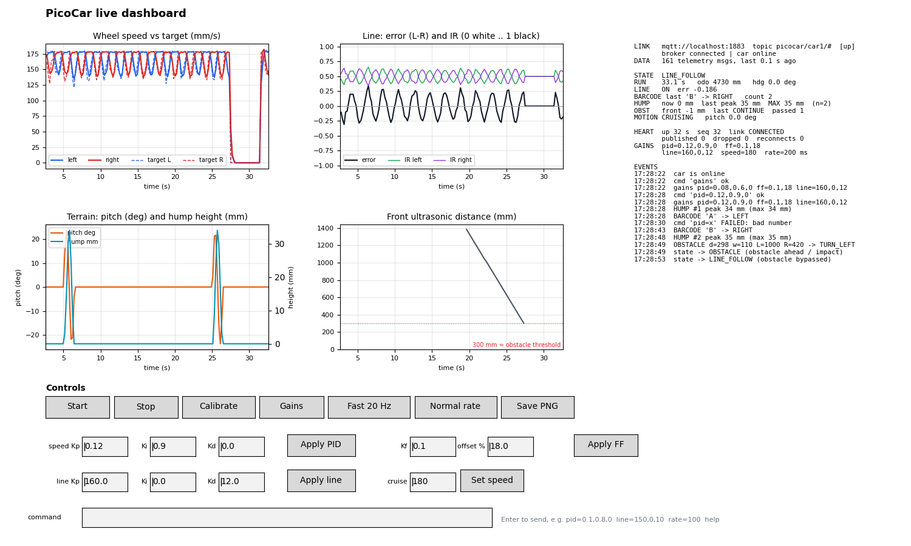

# PicoCar dashboard (Buddy 1)

Live telemetry, live tuning and CSV logging for the PicoCar, on your laptop.



## Install (once)
```
pip install -r requirements.txt
```
Windows/macOS Python already includes the Tk window toolkit matplotlib uses.

## Connect
| Car firmware | Command |
|---|---|
| Any build, USB cable to the car | `python picocar_dashboard.py --serial auto` |
| WiFi build (`WIFI_MQTT=1`) | `python picocar_dashboard.py --mqtt <broker-ip> --car car1` |

* `--serial auto` finds the Pico by its USB vendor id; or give the port
  (`--serial COM5`, `--serial /dev/ttyACM0`). `--list-ports` shows them.
* Close any other serial monitor first (only one program can open the port).
* MQTT: run a broker on the laptop (`mosquitto -v`), put the laptop's IP in
  `template/config/mqtt_config.h`, and allow port 1883 through the firewall.
* No display? `--headless` logs and prints a status line each second; type
  commands in the terminal.

## Screen
* **Plots (last 30 s):** wheel speed vs target, line error + IR,
  pitch + hump height, front distance with the 300 mm obstacle threshold.
* **Status:** state, barcode, hump max peak, obstacles, heartbeat and link
  health (reconnects, dropped messages), the gains currently in the car.
* **Events:** state changes, barcodes, humps, obstacles, impacts, command acks.
* **Controls:** Start / Stop / Calibrate, Gains (read back), Fast 20 Hz /
  Normal telemetry, Save PNG, tuning boxes and a free command box.

## Live tuning (no reflashing)
The tuning boxes fill in from the car. Edit and press **Apply**:

| Box / command | Meaning | Default (`car_config.h`) |
|---|---|---|
| `pid=kp,ki,kd` | wheel-speed PID | `SPEED_KP/KI/KD` 0.08, 0.6, 0 |
| `ff=kf,offset` | feed-forward %/(mm/s), friction offset % | `SPEED_KF` 0.10, `SPEED_OFFSET_PCT` 18 |
| `line=kp,ki,kd` | line-following PID | `LINE_KP/KI/KD` 160, 0, 12 |
| `speed=mm/s` | cruise speed (60..400) | `SPEED_CRUISE_MM_S` 180 |
| `rate=ms` | telemetry period, 0 = off | 200 (MQTT), 1000 (USB) |

Other commands: `start`, `stop`, `calibrate`, `gains`, `help`.
The car answers every command with an event (`cmd ... ok` or the reason it
failed) and then reports the gains now in use.

**Gains live in RAM:** they reset on reboot. When you are happy, copy the
final values (shown under GAINS, and in `commands.log`) into `car_config.h`.

Suggested workflow for speed PID (with `APP_MODE=TEST_MOTOR`):
1. Press START on the car: an open-loop sweep, then step responses (CSV in
   `console.log`).
2. Press **Fast 20 Hz** to watch the step response in the speed plot.
3. Change `pid=` / `ff=`, press START again (only the steps repeat), compare.

Line PID: build `MISSION`, press **Start**, and adjust `line=` while the car
follows the line; watch the line-error plot settle.

## Logs (for the report)
Each run creates `logs/<date_time>/`:

| File | Content |
|---|---|
| `telemetry.csv` | every telemetry message in engineering units (deg, mm, mm/s, 0..1) |
| `events.csv` | all events as JSON (barcodes, humps, obstacles, command acks, gains) |
| `heartbeat.csv` | link health once per second (MQTT) |
| `commands.log` | every command you sent, timestamped |
| `console.log` | raw serial console (includes the TEST_xxx CSV output) |
| `dashboard_*.png` | saved with **Save PNG** |

## Try it without the car
```
mosquitto -v                                   # terminal 1
python sim_car.py --mqtt localhost --autostart # terminal 2
python picocar_dashboard.py --mqtt localhost   # terminal 3
```
`sim_car.py` publishes the same messages as the firmware (barcode every
15 s, 35 mm hump every 20 s, obstacle every 30 s) and obeys the same
commands; its wheels use the firmware's PID law, so tuning changes are
visible.
